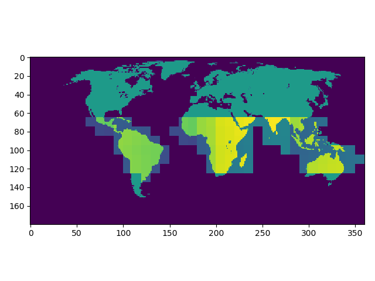

# GLAD alert TRASE 

A script or python library to download glad alerts and calculate them for each muncipality based on the shape files provided by trase. This script will need to be run periodically as a cron job in order to be kept up to date with current alerts. 

## What are glad alerts
http://glad-forest-alert.appspot.com/

The dataset presented tries to emulate near real-time forest loss using LANSAT satelite imagery. The earth is divided into rectangular tiles of differing sizes representing different regions of the world.  "South America and South East Asia tiles have dimensions of 10°x10°. Central Africa tiles have dimensions of 14°x14°. Far eastern Russia is a single image with dimensions of 12°x11°".

 An example test plot of tile shapes (countries not to scale)</img> 

### Resolution and Index
Tiles are represented as Tagged Image Format files (tiff) and have a spatial resolution of 0.00025° per pixel, this equates to ~ 28 metres at the equator. Their correspoding date, left bottom and right top coordinates are provided within the filename - `GLADalert_2019_08_04_obsDate_060W_10S_050W_00N.tif`.

Within a file, the status of an area is given by the value encoded within its respective pixel. Forrest loss is defined as a loss of >50% of a pixel's canopy cover. These may be split into three categories  - encoded in the unsigned 8 bit values given below:

- `0`  No loss 
- `2`  Probable Loss - A single observation flagged as a loss, if this does result in a confirmed loss, it reverts back to 0. 
- `3` A confimed loss is produced by repeat observations in 180 days (or 4 consequtive observations). 

## Available files
### Forest Loss Alert (alert)
Alert information for days with the above encodings. 

### Day of year of forest loss alert (alertDate)
Day of year of the first observation flagged as loss within 2018 encoded in unsigned 16-bit values.

### Landsat cloud-free image composite of the most recent observation (last)
Reference multispectral imagery from the most recent cloud-free observation encoded in unsigned 8-bit values.

### Day of year of the most recent observation (obsDate)
Day of year of the most recent cloud-free observation within the 2019 encoded in unsigned 16-bit values. Zero values indicate there has not yet been a cloud-free observation this year.

