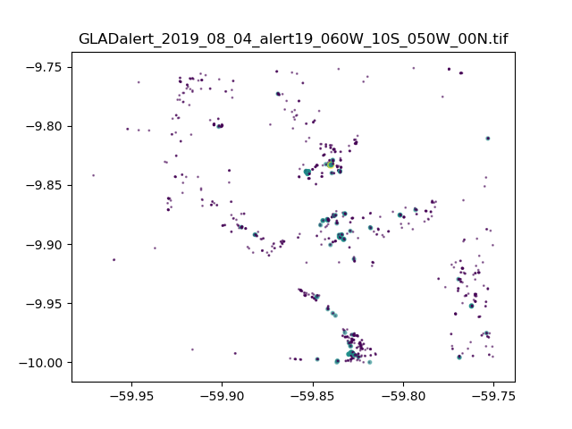
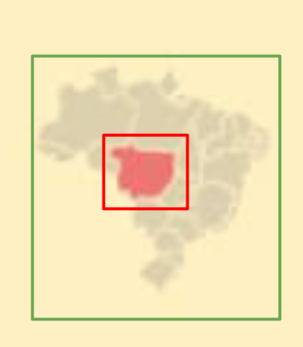

# GLADalertTRASE

A script or python library to download glad alerts and calculate them for each muncipality based on the shape files provided by trase. This script will need to be run periodically as a cron job in order to be kept up to date with current alerts.

## What are glad alerts?
http://glad-forest-alert.appspot.com/

The dataset presented tries to emulate near real-time forest loss using LANSAT satelite imagery. The earth is divided into rectangular tiles of differing sizes representing different regions of the world.  "South America and South East Asia tiles have dimensions of 10°x10°. Central Africa tiles have dimensions of 14°x14°. Far eastern Russia is a single image with dimensions of 12°x11°".

An example test plot of tile shapes (countries not to scale)

* ### Resolution and Index
Tiles are represented as Tagged Image Format files (tiff) and have a spatial resolution of 0.00025° per pixel, this equates to ~ 28 metres at the equator. Their correspoding date, left bottom and right top coordinates are provided within the filename - `GLADalert_2019_08_04_obsDate_060W_10S_050W_00N.tif`.

Within a file, the status of an area is given by the value encoded within its respective pixel. Forrest loss is defined as a loss of >50% of a pixel's canopy cover. These may be split into three categories  - encoded in the unsigned 8 bit values given below:

- `0`  No loss
- `2`  Probable Loss - A single observation flagged as a loss, if this does result in a confirmed loss, it reverts back to 0.
- `3` A confimed loss is produced by repeat observations in 180 days (or 4 consequtive observations).

#### NOTE - tiles vary in location between years!

## Available files
* ### Forest Loss Alert (alert)
Alert information for days with the above encodings.

* ### Day of year of forest loss alert (alertDate)
Day of year of the first observation flagged as loss within 2018 encoded in unsigned 16-bit values.

* ### Landsat cloud-free image composite of the most recent observation (last)
Reference multispectral imagery from the most recent cloud-free observation encoded in unsigned 8-bit values.

* ### Day of year of the most recent observation (obsDate)
Day of year of the most recent cloud-free observation within the 2019 encoded in unsigned 16-bit values. Zero values indicate there has not yet been a cloud-free observation this year.

## Downloading of the data
A link to browse all available files using the online browser (using the google stroage browser console): https://console.cloud.google.com/storage/browser/earthenginepartners-hansen/GLADalert

Although it is possible to scrape the data directly from the downloads page, ultimately this is provided through the public bucket `earthenginepartners-hansen` on the google cloud servers.

* ### Access
The easiest way to access this is through the gsutil comand line application which can be installed through a variety ways including the pypy repository. To use this replace the `https` of our desired file link e.g. `https://storage.cloud.google.com/earthenginepartners-hansen/GLADalert/2019/08_04/alert19_060W_10S_050W_00N.tif` with `gs`, and then we may use gsutils copy function as such:

` gsutil cp gs://<fileurl> <location to place file>`

* ### Determining what is available
It is also possible to determine what files are available in a sub repository with gsutils list function. Wildcard matching of filenames may also be used here e.g.
`gsutil ls -d gs://storage.cloud.google.com/earthenginepartners-hansen/GLADalert/2019/*/alert18_*`

## Testing the tiles
`python -m GLADalertTRASE.test_tile <your tile filename>.tif`
Since each tile is too large to be plotted normally, that and many of the encodings cause problems with other programs, it makes sense to open it programatically. This can be done using the test script above.

The described script resixes the image into a 10000x10000 grid, and can plot it using the default pillow image viewer (imagemagick) or matplotlib. An example test plot showing the alerts within a tile is provided below. Here points represent alert, with the larger 'steelblue' circles representing confirmed alerts.

# The Code
Although not finished, this will ultimately form a python library containing automated documentation. This (README.md) is a report and overview of the different functionalities of the code.

## Exctracting the dataset
`python -m GLADalertTRASE.update_data`

* ### Parallelism
Within the glad dataset there exist 115 separate files, all containing ~ 40,000 pixels each. With 365 days in a year, this soon amounts to a very slow and tedious process in reading and extracting information about them. To overcome this each days worth of tiles is processed in parallel using an MPI initiated through the python command above. An instance of mpi and the mpi4py libraries need to be installed prior to running this. This still takes a couple of hours to complete a month provided all the data is available.

For robustness only the downloading of the 115 tiles for a single day have been parallelised. This creates a redundancy, where should one run fail, or crash, it does not corrupt the h5 file, and the required day can be appended at a later point simply by rerunning the script.

* ### TestRegions
Test regions may be supplied in the files to save having to re-compute/download everything each time in the development stage. These are located in `GLADalertTRASE/update_data/__main__.py` for locations (`__testRegion__`).

* ### Image processing
The code for this is found within `GLADalertTRASE/update_data/functions.py`. Initially this was done by storing the contents for each file as a matrix within in a single binary file for each year, however in trying to record 41975 tiles, the output was tens of gigabytes, which was highly impractical.

It was noted that the alert data was highly sparse in form, with some tiles containing <10 alterts out of their 40,000^2 pixels. It is for this reason that the sparse cooordinate matrix design was chosen. Here we convert the pixel indexes to represent the fraction of Latitude and Longitude that they correspond to and record this in as a 3 column dataframe [Lat, Lon, AlertIndex] , which we save to disk.

 * ### File storage
 Alert data is stored as a Hierarchical Data Format (hdf5) file under `./data/glad_data.h5`. It was decided that a separate file for each year may be preferable. These require the h5py library to be installed. The containing file format is as shown:

 * created_on
 * groups in fomat [MM_YY] from the original data
    * urls - downloaded urls within that month/day combination
    * time - duration taken to download everything (useful for performance analysis)
    * data (dataset): [Lat, Lon, AlertIndex]

Note, if a test filter is used currently if a date exists, it will be skipped when trying to determine future downloads - you need to delete this to add more data (or add further checks - todo)

If the GLADalertTRASE library is imported, it currently has a view function for exploring the data file structure contained within it.

## Shapefiles
`python GLADalertTRASE/shp2geo.py`
Shapefiles are oridinary gis shapefiles downloaded from the TRASE s3 bucket (or wherever is desired). These should be placedd in the `shapefiles` repository under their corresponding country name e.g. brazil.

Once this has been done, you can run the above code to generate the required geoJSON files in the `shapefiles/processed` directory.

## Finding matches
`python -m GLADalertTRASE.update_data`

Since many of the tiles are sparse, it was found to be more space efficient to store alerts in a sparse coordinate matrix. Such a method allows the loading of all global alerts for a single day as a single dataset. In ordering the longitudal and latitudal coordinates, we are able to easily filter data by selecting the smallest boundary match on the left (and the highest on the right), for each respective coordinate axis.

As a method to reduce computation time, we iteratively filter the data using progressively more and more specific boundaries. Firstly a subset is extracted to represent the country we are interested in. Next the max/min bounaries each respective region of interest for that country is selected. Finally all remaining points are fed through a pre-compiled function (using numba) to determine whether they fall within the polygon shape-file of the region.

## Plotting
There will be two sets of plots available. (not yet complete)

### A brushable timeseries
This consists of two line plots, one a brushable and zoomable yearly overview, and one a 'zoomed in' extract (with its region indicated on the yearly plot) showing the last two/three months.

Each line plot may contain a combination of lines including confirmed and possible alerts, previous years, and general metrics such as std.

### A muncipality alert locator
An overview of the muncipality, and where each alert appears. This could potentially be animated over time and consists of contours of all(confirmed and possible) alerts, faint possible alert points and TRASE pink confirmed alerts.

# Attribution
If using this codebase please cite the following:

### The codebase:
(Add zemundo id)

### The data:
Hansen, Matthew C., Alexander Krylov, Alexandra Tyukavina, Peter V. Potapov, Svetlana Turubanova, Bryan Zutta, Suspense Ifo, Belinda Margono, Fred Stolle, and Rebecca Moore. “Humid Tropical Forest Disturbance Alerts Using Landsat Data.” Environmental Research Letters 11, no. 3 (2016): 034008. https://doi.org/10.1088/1748-9326/11/3/034008.
